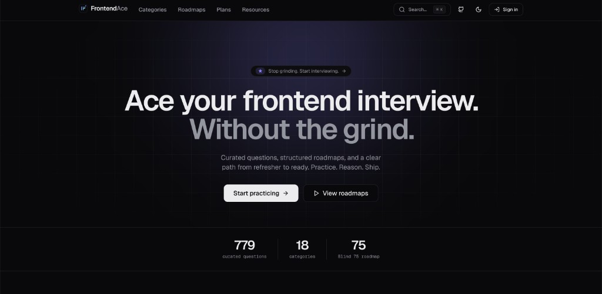
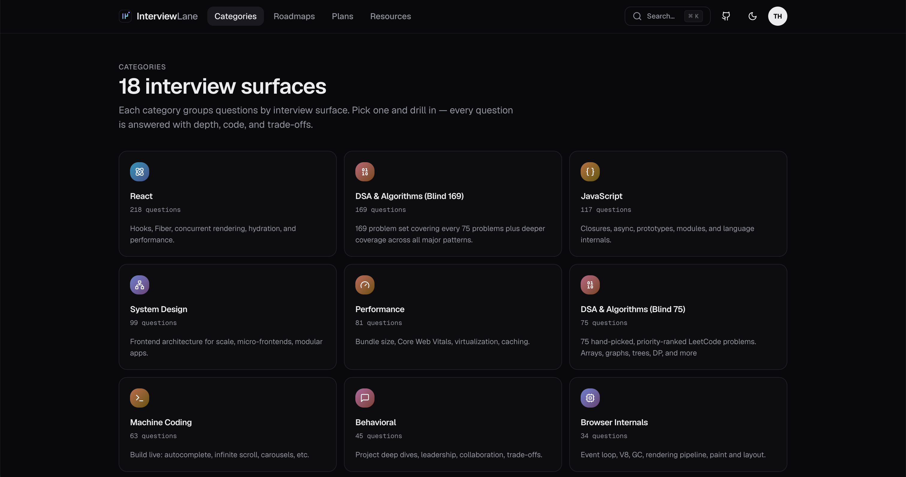
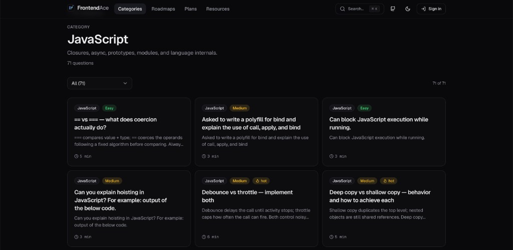
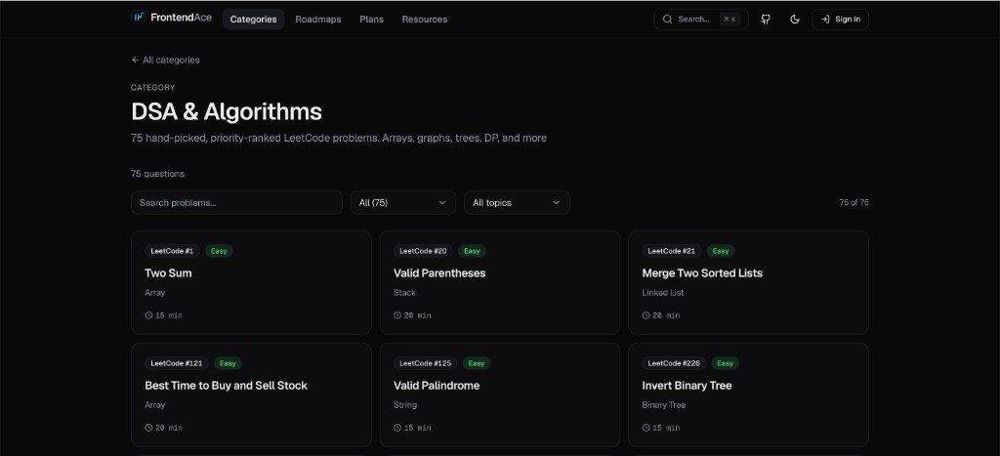
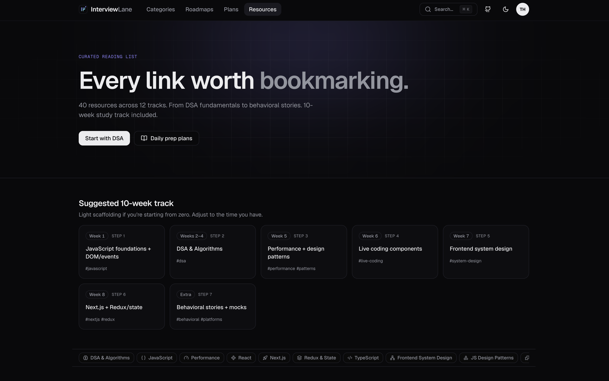

# InterviewLane

**Ace your frontend interview. Without the grind.**

A curated interview prep platform for engineers. Practice structured questions, follow opinionated roadmaps, and walk into your next frontend interview confident.

**Live site → [interviewlane.com](https://interviewlane.com/)**

---



---

## Features

- **700+ curated questions** across 18 categories — JavaScript, React, CSS, System Design, Performance, Browser Internals, and more
- **DSA & Algorithms** — 75 hand-picked LeetCode problems with topics and estimated solve times
- **Structured roadmaps** — Frontend foundations, Senior frontend, and DSA for frontend with phased progression
- **Study plans** — 7-day refresher, 30-day deep prep, and 90-day mastery tracks
- **Daily challenge** — A new problem every day, resets at 00:00 UTC
- **Random round** — 5 questions sampled across categories to simulate a 60-minute interview loop
- **Resources** — Curated reading list organized by topic with a suggested 10-week study track
- **Bookmarks** — Save questions to revisit
- **Full-text search** — Fuzzy search across all questions via ⌘K
- **Authentication** — Sign in to track progress and sync bookmarks across devices
- **Dark mode** — System-aware theme toggle

---

## Screenshots

### Categories



### Category detail — JavaScript



### DSA & Algorithms — Blind 75



### Resources



---

## Tech Stack

| Layer               | Tech                    |
| ------------------- | ----------------------- |
| Framework           | Next.js 15 (App Router) |
| Language            | TypeScript              |
| Styling             | Tailwind CSS            |
| UI Primitives       | Radix UI                |
| Animations          | Framer Motion           |
| Database            | Supabase (Postgres)     |
| Auth                | Supabase Auth           |
| Search              | Fuse.js                 |
| Syntax highlighting | Shiki                   |
| State               | Zustand                 |
| Deployment          | Vercel                  |

---

## Getting Started

### Prerequisites

- Node.js 18+
- A Supabase project

### Install

```bash
git clone https://github.com/The-Atul-Sharma/InterviewLane.git
cd InterviewLane
npm install
```

### Environment variables

Create a `.env.local` file at the root:

```env
NEXT_PUBLIC_SUPABASE_URL=your_supabase_url
NEXT_PUBLIC_SUPABASE_PUBLISHABLE_DEFAULT_KEY=your_supabase_publishable_default_key
SUPABASE_SECRET_KEY=your_supabase_secret_key
NEXT_PUBLIC_GA_ID=your_google_analytics_id
NEXT_PUBLIC_GOOGLE_SITE_VERIFICATION=your_google_site_verification_key
```

### Run locally

```bash
npm run dev
```

Open [http://localhost:3000](http://localhost:3000).

### Database migrations

```bash
# Apply migrations to your Supabase project via the Supabase CLI
supabase db push
```

---

## Project Structure

```
src/
├── app/                  # Next.js App Router pages
│   ├── categories/       # Category listing + detail
│   ├── questions/[slug]/ # Question detail
│   ├── roadmaps/         # Roadmap listing + detail
│   ├── plans/            # Study plan listing + detail
│   ├── resources/        # Curated resources page
│   ├── daily/            # Daily challenge
│   ├── random/           # Random round
│   ├── search/           # Search results
│   ├── bookmarks/        # Saved questions
│   └── dashboard/        # User dashboard
├── lib/
│   ├── repository/       # Data access layer (Supabase queries)
│   ├── schema/           # Zod schemas
│   ├── store/            # Zustand stores
│   ├── categories.ts
│   ├── roadmaps.ts
│   └── resources.ts
content/                  # MDX/markdown question content
supabase/
└── migrations/           # SQL migration files
scripts/                  # DB seeding and content scripts
```

---

## Scripts

```bash
npm run dev          # Start development server
npm run build        # Production build
npm run lint         # ESLint
npm run typecheck    # TypeScript type check
npm run db:add       # Add questions to the database
```

---

## License

MIT
